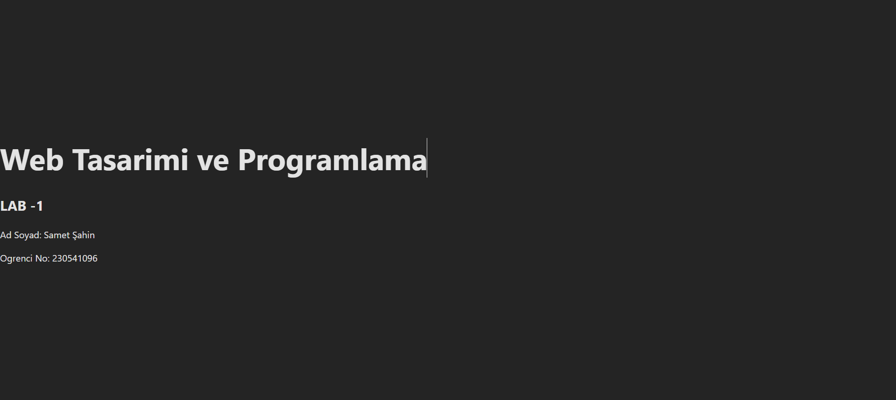

# Web LAB -1 - Hello Project

## Hakkinda
 Bu proje , Web Tasarimi ve Programlama dersi LAB -1 kapsaminda
 Vite + React + TypeScript kullanilarak olusturulmustur.

## Gelistirici
- **Ad Soyad:** Samet Şahin
- **Ogrenci No:** 230541096

## Kullanilan Teknolojiler
- React 18
- TypeScript
- Vite

## Kurulum
```bash
npm install
```

## Calistirma
```bash
npm run dev
```
Tarayicida http://localhost:5173 adresini ac.

## Ekran Goruntusu



