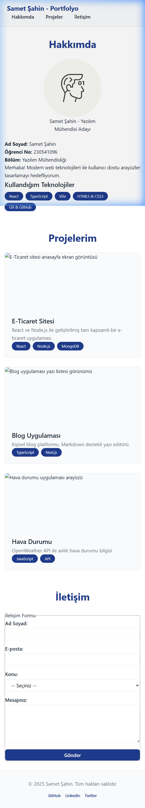
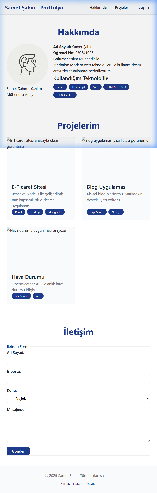
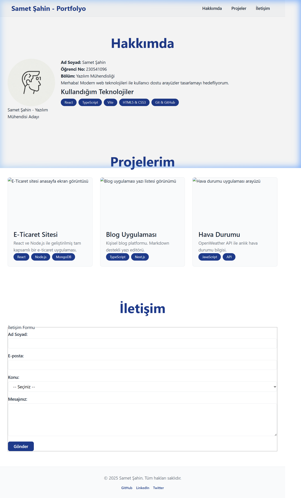

# Web Lab - 3: Responsive Portfolyo Sitesi

Bu proje, Web Lab - 3 kapsamında geliştirilen, modern CSS teknikleri (Design Tokens, Flexbox, CSS Grid) kullanılarak tam responsive (duyarlı) hale getirilmiş bir portfolyo sitesidir.

## 🚀 Proje Özellikleri

- **Design System:** `tokens.css` üzerinden yönetilen merkezi tasarım değişkenleri (Renkler, Boşluklar, Tipografi).
- **Akışkan Tasarım:** `clamp()` fonksiyonu ile ekran boyutuna göre otomatik ölçeklenen yazı boyutları (Fluid Typography).
- **Hibrit Yerleşim:** Navigasyon için Flexbox, proje kartları için CSS Grid `auto-fit` yapısı.
- **Erişilebilirlik:** Semantik HTML etiketleri, ARIA nitelikleri ve belirgin odaklanma (focus) göstergeleri.
- **Dil Desteği:** Tamamen Türkçe içerik ve doğru karakter kullanımı.

## 📸 Ekran Görüntüleri (Responsive Views)

Aşağıda projenin farklı cihazlardaki görünümü yer almaktadır:

### 📱 Mobil Görünüm (375px)


### 📑 Tablet Görünümü (768px)


### 💻 Masaüstü Görünümü (1280px)


## 📂 Dosya Yapısı

- `src/styles/tokens.css`: Tasarım sistemi değişkenleri.
- `src/App.css`: Responsive layout ve bileşen stilleri.
- `CSS_DECISIONS.md`: Mimari kararların teknik açıklaması.
- `screenshots/`: Responsive test çıktıları.

## 🛠️ Kurulum

```bash
npm install
npm run dev
```
