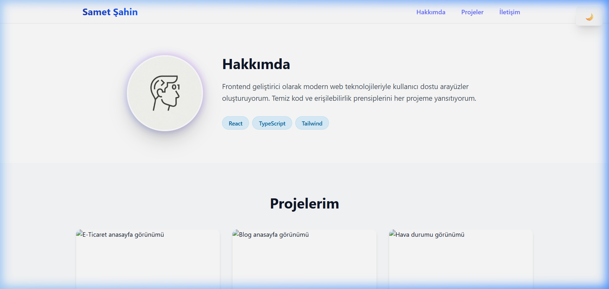
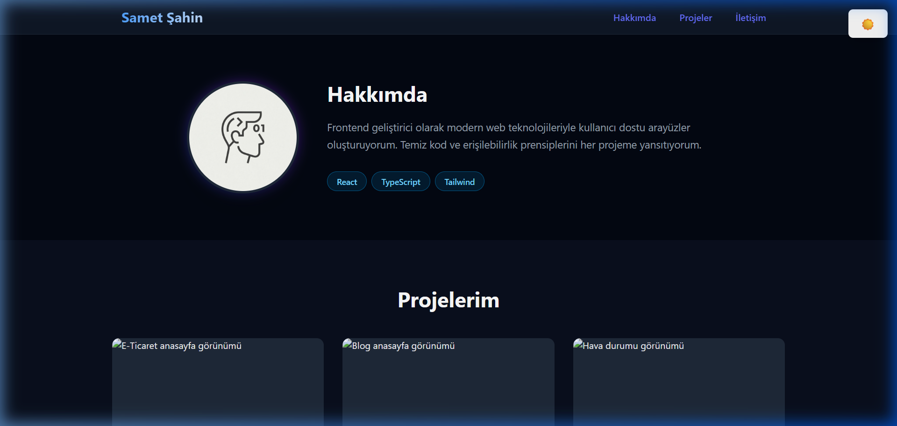
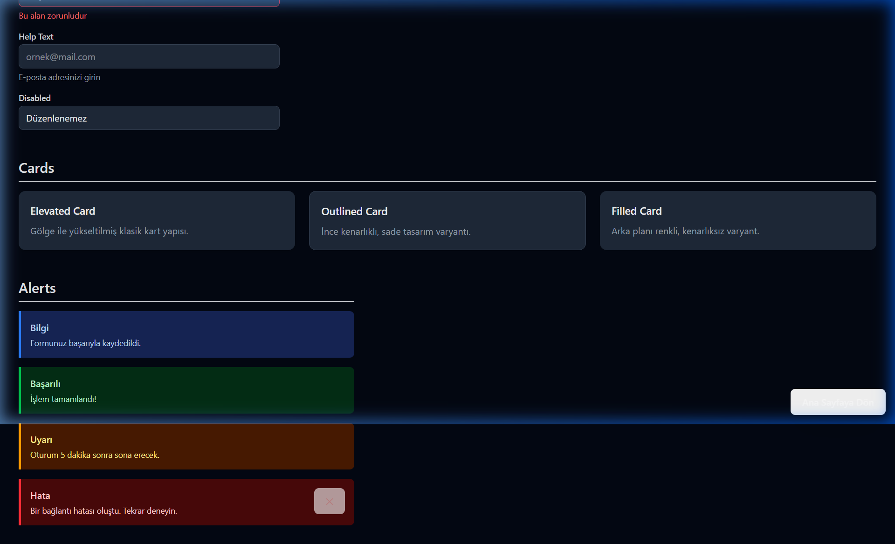

# Web Lab - 4: Tailwind CSS v4 & Component Architecture

Bu proje, Web Lab - 4 kapsamında geliştirilen; Tailwind CSS v4'ün "Utility-First" yaklaşımı, özel tema yapılandırması ve yeniden kullanılabilir bileşen mimarisi (Button, Input, Card, Alert) ile inşa edilmiş modern bir portfolyo sitesidir.

## 🚀 Proje Özellikleri

- **Tailwind CSS v4:** En güncel Tailwind sürümü ile `@theme` direktifi ve modern utility class'lar kullanılmıştır.
- **Özel Tema (Sky Blue):** Projenin ana renk paleti modern ve ferah bir "Gök Mavisi" (`#0EA5E9`) tonuna göre özelleştirilmiştir.
- **Bileşen Mimarisi:** 
  - **Button:** 4 farklı renk varyantı ve 3 boyut desteği.
  - **Input:** Hata durumu, yardım metni ve pasif mod desteği.
  - **Card:** Elevated, Outlined ve Filled varyantları ile responsive hizalama.
  - **Alert:** Durum bildirimleri için kapatılabilir uyarı pencereleri.
- **Dark Mode:** `@custom-variant dark` ile tam uyumlu, göz yormayan karanlık tema desteği.
- **UI Kit:** Tüm bileşen varyantlarının test edilebildiği kapsamlı kütüphane sayfası.

## 📸 Ekran Görüntüleri

### ☀️ Ana Sayfa (Gündüz Modu)


### 🌙 Ana Sayfa (Gece Modu)


### 🧪 UI Kit (Bileşen Kütüphanesi)


## 📂 Dosya Yapısı

- `src/components/`: Yeniden kullanılabilir atomik bileşenler.
- `src/pages/UIKit.tsx`: Tüm bileşen varyantlarını sergileyen sayfa.
- `src/index.css`: Tailwind v4 tema ve özel varyant tanımları.
- `src/App.tsx`: Portfolyo bölümlerinin (About, Projects, Contact) birleştirildiği ana dosya.

## 🛠️ Kurulum ve Çalıştırma

```bash
# Bağımlılıkları kur
npm install

# Geliştirme sunucusunu başlat
npm run dev
```
