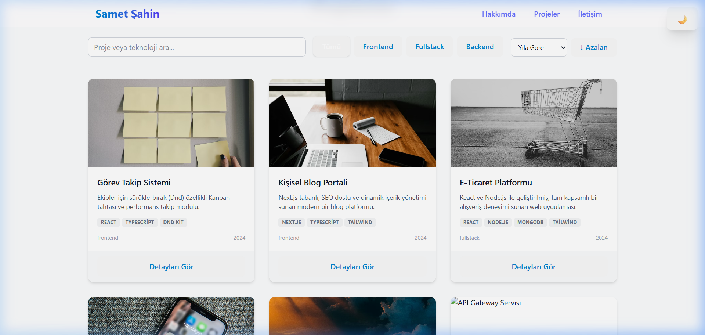
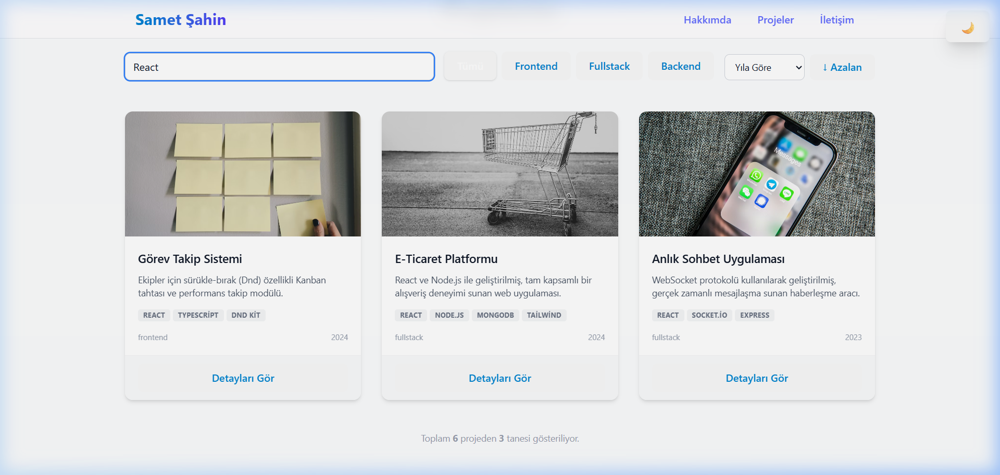
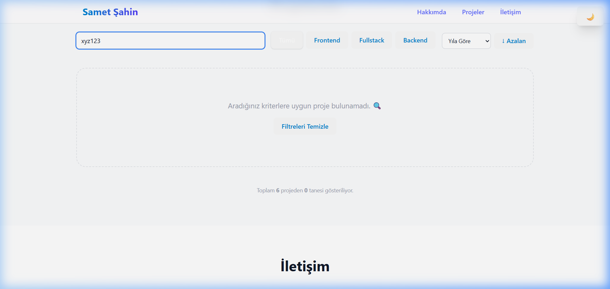

# Web Lab - 5: JavaScript/TypeScript & State Management

Bu proje, Web Lab - 5 kapsamında geliştirilen; TypeScript'in tip güvenliği, React'in dinamik state (durum) yönetimi ve asenkron veri çekme (Fetch API) mimarisiyle güçlendirilmiş bir portfolyo uygulamasıdır.

## 🚀 Lab 5 Yenilikleri

- **Dinamik Veri Yönetimi:** Projeler `projects.json` dosyasından asenkron olarak çekilmektedir.
- **TypeScript Model:** Tüm veri akışı `Project`, `Category` ve `FilterState` arayüzleriyle (Interface) kontrol altına alınmıştır.
- **Akıllı Filtreleme ve Arama:** 
  - Başlık, açıklama ve teknolojilere göre anlık metin araması.
  - Kategori bazlı (Frontend, Backend, Fullstack) filtreleme.
  - Yıl ve Başlık bazlı, Türkçe karakter duyarlı sıralama.
- **Gelişmiş Durum Yönetimi (UX):** 
  - Veri yüklenirken animasyonlu spinner gösterimi.
  - Hatalı veri durumunda kullanıcıyı bilgilendiren Alert sistemi.
  - Boş arama sonuçları için özel "Filtreleri Temizle" ekranı.

## 📸 Lab 5 Ekran Görüntüleri

### 📦 Dinamik Proje Listesi (Tümü)


### 🔍 Canlı Arama ve Filtreleme (React araması)


### 🌑 Boş Sonuç Durumu (Hatalı arama)


## 📂 Dosya Yapısı (Lab 5 Odaklı)

- `src/types/project.ts`: Veri ve filtre modellerinin tanımları.
- `src/services/projectService.ts`: Fetch API ile veri çekme işlemleri.
- `src/utils/projectHelpers.ts`: Filtreleme ve sıralama algoritmaları.
- `public/data/projects.json`: Dinamik proje verileri.

## 🛠️ Kurulum ve Çalıştırma

```bash
npm install
npm run dev
```
